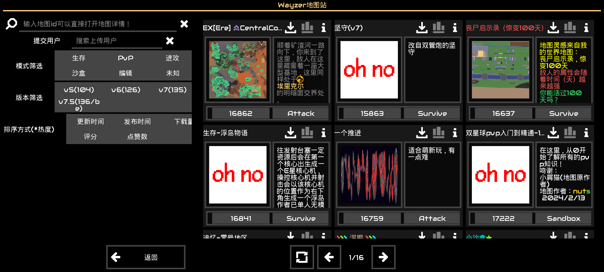
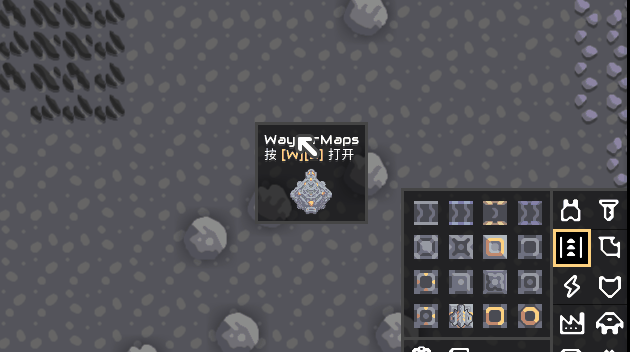
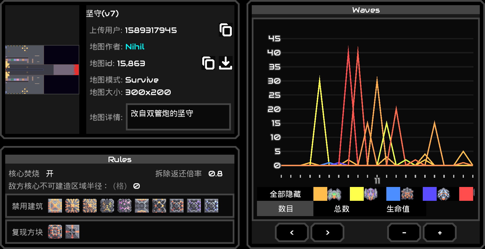
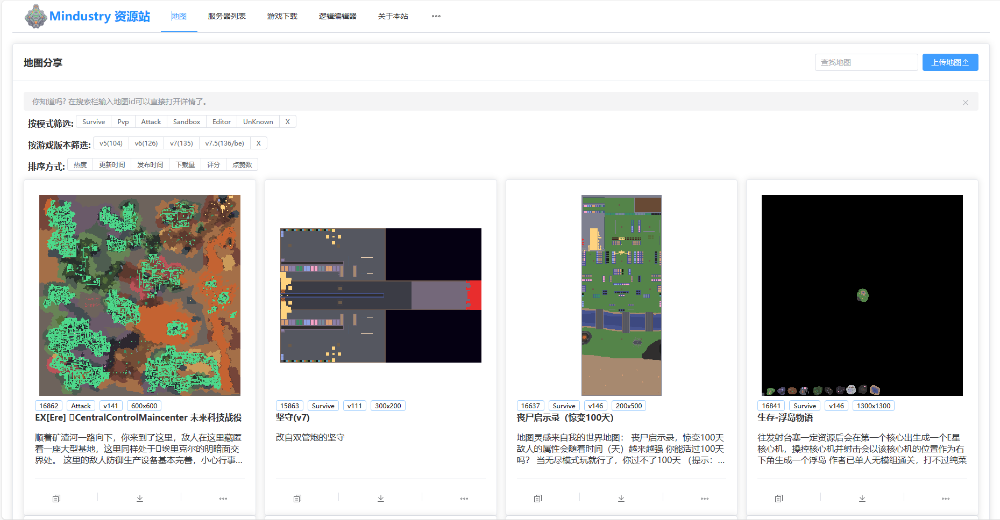

# Wayzer地图站 客户端Mod 

### 高度自定义UI

### 快速下载导入地图
可用于一些装载Wayzer插件服务器

### 快速服务器内投票

### 地图详情

* 地图规则
* 波次查询

## [Wayzer地图站]

由 wayzer 搭建运营

是国内**生态最完善**的地图站

[Wayzer地图站]: https://www.mindustry.top/map